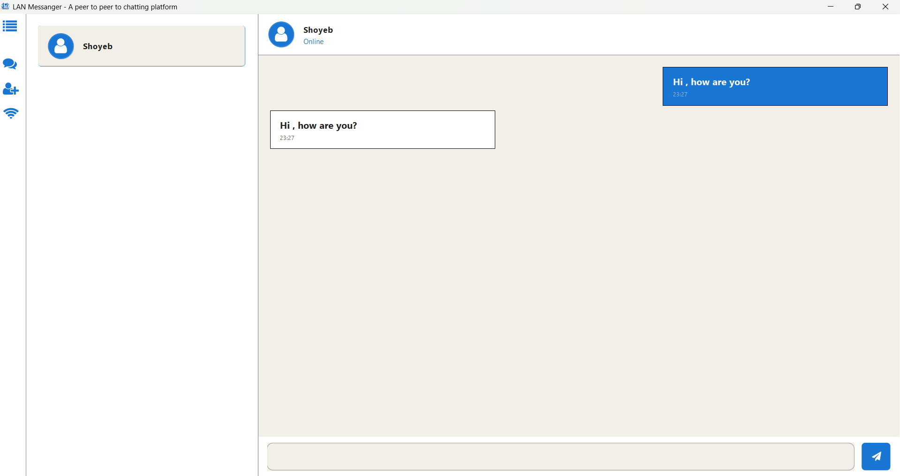
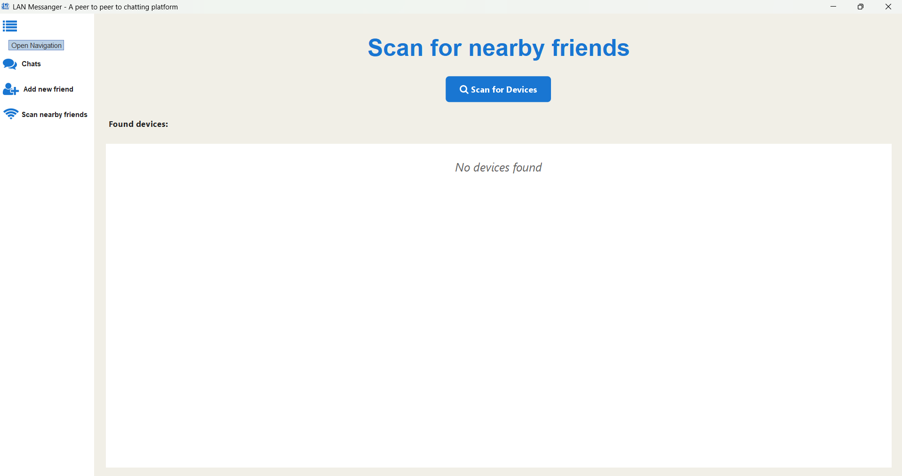
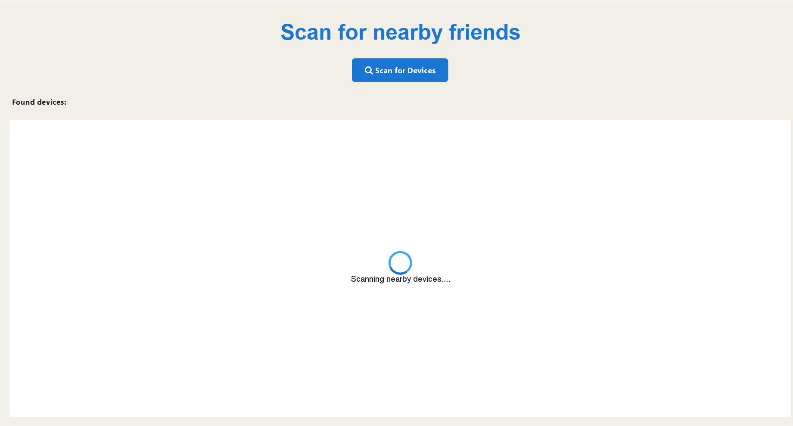
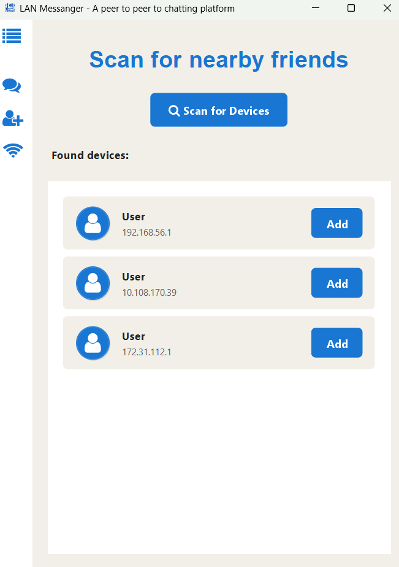
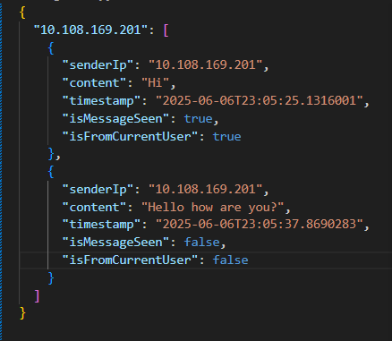
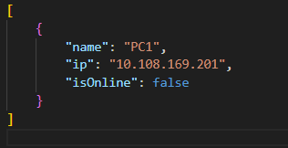
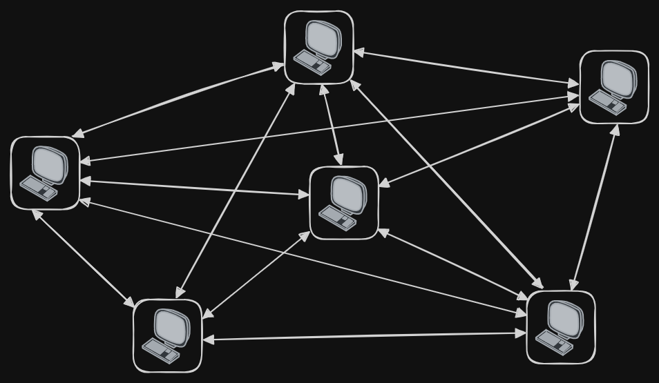
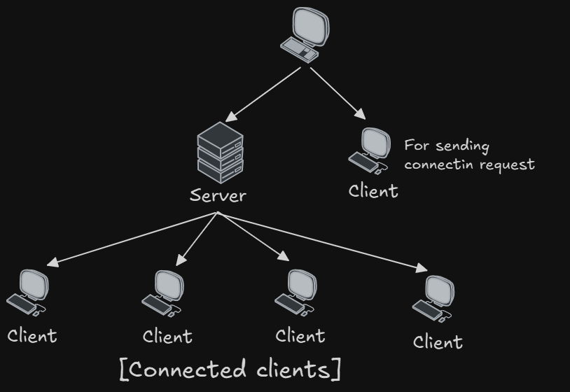

# **LAN Messenger: Peer-to-Peer Chat Application**

              

A **peer-to-peer Java-based chat application** for devices on the same LAN using **Socket programming** and **Swing GUI**.

  

---

## Feature of the LAN Messanger

  
  
Start Page

- LAN Messagner is build using java programming langauge. This application has following features:

### 1. Single Page Application
  - This application is built on a single page like modern web application. This improves the accessibility of different features of the application and greatly improve the UX.
  - React like state management using java interface and classes.

  
  
Single Page Application can be navigated through Navigation Bar

### 2. Discovering Friends
  - This application provides a way to discover users that are connected to same network and have opened the application.
  - I am using UDP protocol to quickly send the small data packets to check and find the users.

  
  

### 3. Persistent Storage
  - The data of the application (Friends of the user, and conversation with the friend) are stored permanently on local computer.
  - I am storing the data in `json`, I am converting the java object into `json` using `GSON` library.
  - The data are private and only present in the users' desktop

  
  

### 4. Add Friend Functionality
  - If the user have the IP Address of the friend then user can add the friend to his/her list.

### 5. Responsive
  - The application is completely responsive. The layout of the application have been changes on change of dimension.

### 6. Real Time Chatting
  - The user can chat with the user in real time if the user is connected

| Folder      | Purpose                                        |
| ----------- | ---------------------------------------------- |
| `app`       | Launch logic and global config                 |
| `network`   | Networking: sockets, scanning, and connections |
| `ui`        | GUI built with Swing                           |
| `model`     | Data classes and storage handling              |
| `public` | Static files like images or sound (optional)   |

<i>Breakdown of roles</i>

## Architecture

  
  
P2P connection of different instance of LAN Messanger 

  
  
A single instance working both as a client and server 

