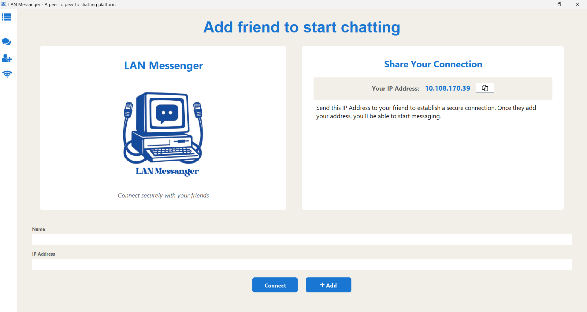
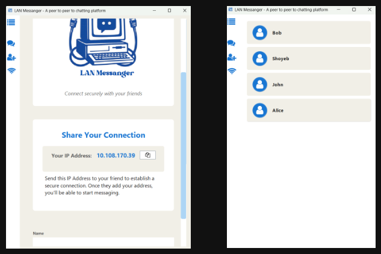
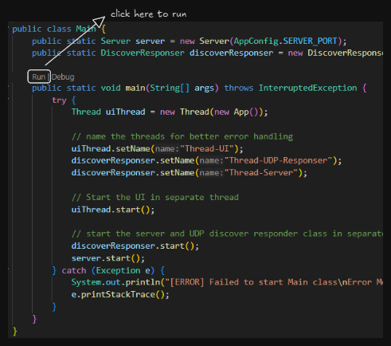
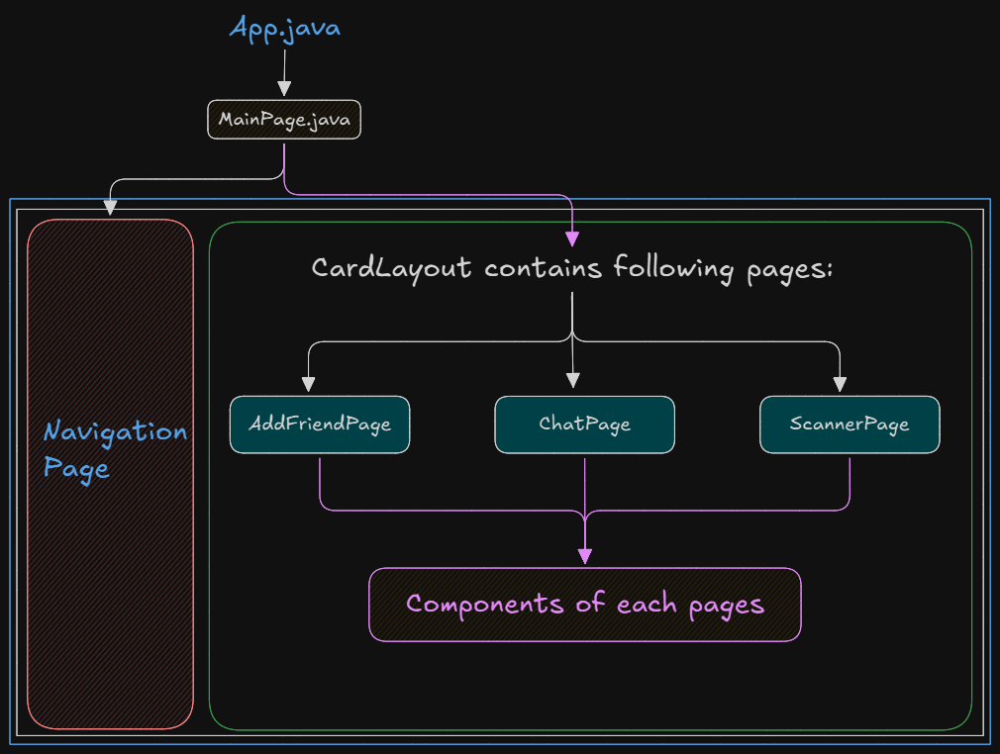

# **LAN Messenger: Real-Time Peer-to-Peer Chat Application**

              

A **powerful peer-to-peer Java chat application** designed for seamless communication between devices on the same Local Area Network (LAN). Built with advanced **Socket programming**, **multithreading**, and an intuitive **Swing GUI** for cross-platform compatibility.

<p align="center">
  
</p>

---

## 🚀 Key Features

### ✨ **What Makes LAN Messenger Special?**

🔥 **Zero Internet Required** - Works entirely on your local network  
⚡ **Real-time Communication** - Instant message delivery with TCP protocol  
🔍 **Auto Friend Discovery** - Automatically find other users on your network  
💾 **Persistent Chat History** - All conversations saved locally and securely  
🎨 **Modern Single-Page Interface** - React-inspired design with smooth navigation  
📱 **Fully Responsive** - Adapts to any screen size and resolution  
🌐 **Cross-Platform Compatible** - Works on Windows, macOS, and Linux  

---

## 📦 Quick Downloads

**Ready-to-use installers for popular operating systems:**

💻 **[Windows Installer (.exe)](https://yourhost.com/lanmessanger/installer.exe)** - One-click installation  
🍎 **[macOS App Bundle (.dmg)](https://yourhost.com/lanmessanger/lanmessenger.dmg)** - Drag and drop installation  

**Need support for other platforms?** Contact us at: [shoyebff45@gmail.com](mailto:shoyebff45@gmail.com)

---

## 🎯 Core Features Deep Dive

<p align="center">
  
  <p align="center"><em>Clean and intuitive start page</em></p>
</p>

### 1. **Modern Single-Page Application (SPA)**
Built with a contemporary approach similar to modern web applications, featuring:
- **State Management**: React-inspired state handling using Java interfaces and classes
- **Smooth Navigation**: Seamless page transitions without window reloads
- **Enhanced UX**: Improved accessibility and user experience

<p align="center">
  
  <p align="center"><em>Intuitive navigation bar for easy access to all features</em></p>
</p>

### 2. **Intelligent Friend Discovery**
Advanced network scanning capabilities:
- **UDP Protocol**: Lightning-fast user detection on the same network
- **Real-time Updates**: Automatically refreshes available users
- **Zero Configuration**: Works out-of-the-box without manual setup

<p style="display: flex; gap: 4px; justify-content: center;">
  
  
</p>

### 3. **Secure Local Storage**
Your data remains private and secure:
- **JSON Storage**: Efficient data serialization using GSON library
- **Local-Only**: All data stored exclusively on your device
- **Persistent History**: Conversations and friend lists automatically saved

<p style="display: flex; gap: 10px; justify-content: center;">
  
  
</p>

### 4. **Manual Friend Addition**
Flexible friend management:
- **IP Address Support**: Add friends directly using their IP address
- **Friend Requests**: Secure friend request system
- **Contact Management**: Easy-to-use friend list interface

<p align="center">
  
  <p align="center"><em>Simple and secure friend addition process</em></p>
</p>

### 5. **Responsive Design**
Adapts to any screen configuration:
- **Dynamic Layouts**: Automatically adjusts to window resizing
- **Multi-Resolution Support**: Works on various screen sizes
- **Consistent Experience**: Maintains functionality across different dimensions

<p align="center">
  
</p>

### 6. **Real-Time Messaging**
Experience instant communication:
- **TCP Protocol**: Reliable message delivery
- **Multi-threading**: Smooth performance without UI freezing
- **Live Status Updates**: See when friends are online and available

---

## 🏗️ Project Architecture

**Modular design for maximum maintainability and scalability:**

```plaintext
📁 LAN-Messenger/
├── 📁 lib/                        # External JAR dependencies
├── 📁 public/                     # Static assets and images
│   └── 📁 images/
│       ├── 📁 app/               # Application icons and graphics
│       └── 📁 readme/            # Documentation images
└── 📁 src/
    └── 📁 main/
        └── 📁 java/
            └── 📁 com/
                └── 📁 lanmessanger/
                    ├── 📁 app/           # Application entry point and configuration
                    ├── 📁 database/      # Data persistence and management
                    ├── 📁 models/        # Data models and entity schemas
                    ├── 📁 network/       # Core networking functionality
                    │   ├── 📁 client/           # Client-side communication
                    │   ├── 📁 clientHandler/    # Connection management
                    │   ├── 📁 discovery/        # Network discovery logic
                    │   └── 📁 server/           # Server-side operations
                    └── 📁 ui/            # User interface components
                        ├── 📁 components/        # Reusable UI components
                        │   ├── 📁 addFriendPage/
                        │   ├── 📁 chatPage/
                        │   ├── 📁 navBar/
                        │   └── 📁 scannerPage/
                        ├── 📁 pages/            # Application pages
                        ├── 📁 router/           # SPA-style navigation
                        ├── 📁 state/            # Centralized state management
                        └── 📁 utils/            # Helper utilities
```

### 📋 **Architecture Overview**

| Component | Responsibility | Key Features |
|-----------|----------------|--------------|
| **`app/`** | Application lifecycle and global configuration | Launch logic, settings management |
| **`network/`** | Core networking operations | Socket programming, P2P connections, discovery |
| **`ui/`** | User interface and user experience | Swing components, responsive design |
| **`models/`** | Data structures and persistence | Entity definitions, JSON serialization |
| **`database/`** | Local data management | Friend lists, chat history, user preferences |

---

## 🛠️ Technology Stack

### **Core Technologies**
- **☕ Java 17+** - Modern Java features and performance optimizations
- **🎨 Java Swing** - Cross-platform GUI framework (`javax.swing`)
- **🌐 Java Networking** - Socket programming with TCP/UDP protocols (`java.net`)
- **⚡ Collections Framework** - Efficient data structure management
- **📄 Gson Library** - JSON serialization and deserialization (`com.google.gson`)
- **🎯 Ikonli FontAwesome** - Modern icon pack (`org.kordamp.ikonli`)

### **Development Tools**
- **💻 VS Code IDE** - Modern development environment
- **📚 Git & GitHub** - Version control and collaboration
- **🔧 Maven** - Dependency management and build automation

---

## 🚀 Quick Start Guide

### **Prerequisites**
Ensure you have Java 17 or higher installed:
```bash
java --version
```

### **Installation & Setup**

1. **Clone the Repository**
   ```bash
   git clone https://github.com/Shoyeb45/lan-messanger.git
   cd lan-messenger
   ```

2. **Development Setup (VS Code)**
   - Install [Extension Pack for Java by Microsoft](https://marketplace.visualstudio.com/items?itemName=vscjava.vscode-java-pack)
   - Navigate to `src/main/java/com/lanmessanger/Main.java`
   - Click the **Run** button above the main method

   <p align="center">
     
   </p>

3. **Alternative Build Methods**
   ```bash
   # Using Maven (if pom.xml is configured)
   mvn clean compile exec:java
   
   # Direct compilation (for simple setups)
   javac -cp "lib/*:src" src/main/java/com/lanmessanger/Main.java
   java -cp "lib/*:src" com.lanmessanger.Main
   ```

### **Contributing**

We welcome contributions! Here's how to get started:

1. **Create a Feature Branch**
   ```bash
   git checkout -b feature/your-feature-name
   ```

2. **Implement Your Feature**
   - Write clean, documented code
   - Test thoroughly on multiple platforms
   - Follow existing code style conventions

3. **Submit Your Changes**
   ```bash
   git add .
   git commit -m "Add: your feature description"
   git push origin feature/your-feature-name
   ```

4. **Create a Pull Request**
   - Include detailed description of changes
   - Add screenshots for UI changes
   - Reference any related issues

---

## 🔧 How It Works

### **Network Architecture**

LAN Messenger implements a sophisticated **peer-to-peer networking model**:

<p align="center">
  
  <p align="center"><em>Decentralized P2P communication between LAN Messenger instances</em></p>
</p>

**Key Networking Features:**
- **TCP Protocol**: Reliable message delivery with connection-oriented communication
- **UDP Discovery**: Fast and lightweight user detection broadcasts
- **Multi-threading**: Concurrent handling of multiple connections
- **Dual Role Architecture**: Each instance acts as both client and server

<p align="center">
  
  <p align="center"><em>Each instance simultaneously operates as client and server</em></p>
</p>

### **User Interface Architecture**

Built with a modern, component-based approach:

<p align="center">
  
  <p align="center"><em>Hierarchical component structure with centralized state management</em></p>
</p>

**UI Design Principles:**
- **Single Page Application**: Smooth navigation without window refreshes
- **Component Reusability**: Modular design for maintainable code
- **State Management**: Centralized application state similar to modern web frameworks
- **Responsive Layout**: Dynamic adaptation to different screen sizes

---

## 🧪 Testing Guide

### **Local Testing Setup**

**Requirements:**
- Two or more devices on the same Wi-Fi network
- LAN Messenger installed on each device

**Step-by-Step Testing:**

1. **Launch Application**
   - Open LAN Messenger on both devices
   - Ensure both devices are connected to the same network

2. **Establish Connection**
   - On Device A: Navigate to "Add Friend" page
   - Enter the IP address of Device B
   - Click "Add Friend"

3. **Accept Friend Request**
   - Device B will receive a friend request notification
   - Accept the request to establish connection

4. **Test Messaging**
   - Send messages between devices
   - Verify real-time delivery and persistence
   - Test various message types and lengths

**Success Indicators:**
- ✅ Real-time message delivery
- ✅ Message persistence after app restart
- ✅ Online/offline status updates
- ✅ Stable connection during extended use

---

## 💻 Platform Support

| Platform | Status | Notes |
|----------|---------|-------|
| **Windows 10/11** | ✅ Full Support | Native installer available |
| **macOS** | ✅ Full Support | DMG package available |
| **Linux (Ubuntu/Debian)** | ✅ Full Support | JAR executable |
| **Linux (Other Distros)** | ✅ Compatible | May require Java installation |

### **System Requirements**
- **Java Runtime**: Version 17 or higher
- **RAM**: Minimum 512MB available
- **Network**: Active LAN/Wi-Fi connection
- **Storage**: 50MB free space

---

## 📚 Additional Resources

### **Learning Resources**
- [Java Socket Programming Guide](https://www.baeldung.com/a-guide-to-java-sockets)
- [Java Swing Tutorial by Bro Code](https://www.youtube.com/@BroCodez)
- [Multithreading in Java](https://docs.oracle.com/javase/tutorial/essential/concurrency/)

### **Documentation**
- [Java Networking API](https://docs.oracle.com/javase/8/docs/api/java/net/package-summary.html)
- [Gson Documentation](https://github.com/google/gson/blob/master/UserGuide.md)
- [Maven Build Lifecycle](https://maven.apache.org/guides/introduction/introduction-to-the-lifecycle.html)

---

## 🙏 Acknowledgments

### **Special Thanks**
- **[Professor Zabi](https://www.linkedin.com/in/syedzaabii/)** - Academic guidance and mentorship
- **[Baeldung](https://www.baeldung.com/)** - Comprehensive Java Socket programming tutorials
- **[Bro Code](https://www.youtube.com/@BroCodez)** - Excellent Java Swing video tutorials
- **AI Assistants** - Code review, debugging assistance, and optimization suggestions
- **[Linus Torvalds](https://github.com/torvalds)** - For creating Git, enabling collaborative development

### **Open Source Libraries**
- **Google Gson** - JSON serialization library
- **Ikonli** - Icon pack integration
- **Java Development Kit** - Core runtime and development tools

---

## 📄 License

This project is licensed under the **MIT License** - see the [LICENSE](LICENSE) file for complete details.

**Key Points:**
- ✅ Commercial use allowed
- ✅ Modification and distribution permitted  
- ✅ Private use encouraged
- ❗ No warranty provided

---

## 🔗 Connect & Support

**Found this project helpful?** ⭐ **Star the repository** to show your support!

**Questions or Issues?** 📧 **[shoyebff45@gmail.com](mailto:shoyebff45@gmail.com)**

**Want to Contribute?** 🚀 **Check out our [Contributing Guidelines](#contributing)**

---

**Keywords:** LAN Messenger, Java Chat Application, P2P Messaging, Local Network Communication, Socket Programming, Real-time Chat, Cross-platform Messaging, Network Discovery, Peer-to-Peer, Java Swing GUI, TCP/UDP Protocol, Multithreading, Local Area Network, Instant Messaging, Java Networking